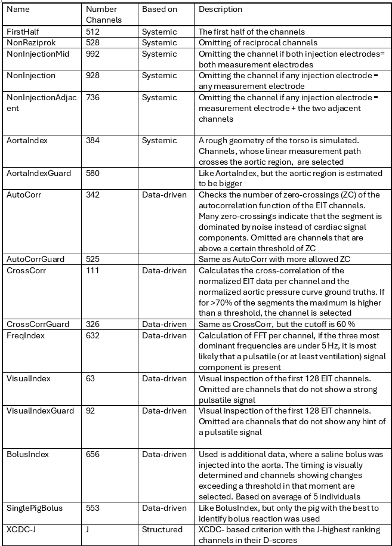
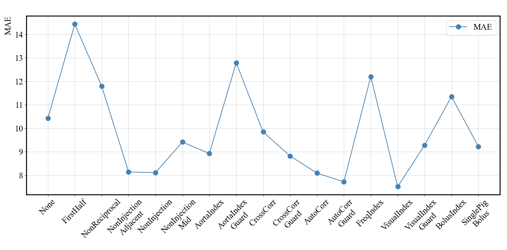
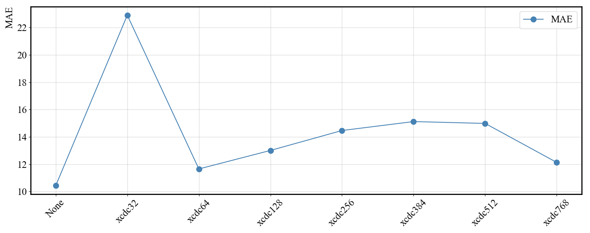
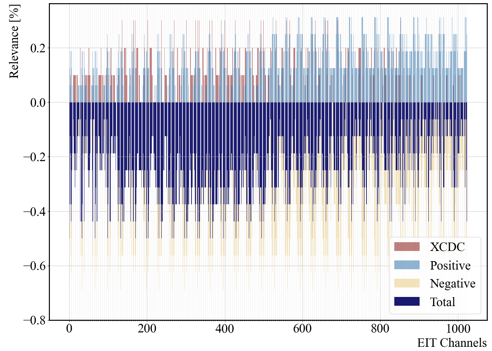
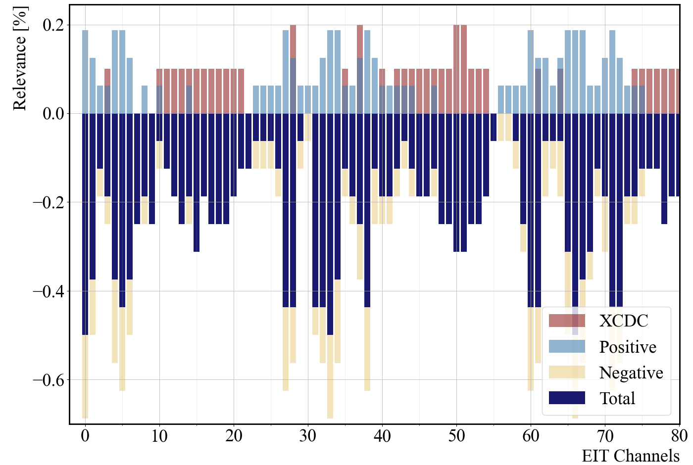

# EIT-Channel-Selection-for-Estimating-Aortic-Blood-Pressure
Investigation, if omitting subsets of channels in 32-electrode EIT data can improve performance and lower 
computational complexity of a CNN estimating aortic blood pressure from EIT


----------------------------------------------------------------------------------------------------------------------------------------
----------------------------------------------------------------------------------------------------------------------------------------
__Abstract:__   
Electrical impedance tomography is a powerful monitoring tool that can be used to estimate
central aortic pressure with a convolutional neural network. This paper explores the selection 
of subsets from the \num{1024} possible channels for reduced computational complexity and improved 
network performance. The results show an improved performance for appropriate selection strategies. 

----------------------------------------------------------------------------------------------------------------------------------------
----------------------------------------------------------------------------------------------------------------------------------------


## Overview:
- [Structure](#structure)
- [Installation](#installation)
- [Channel Selection Strategies](#strategies)
- [Results](#evaluation)
- [Author](#author)


## Structure
This repository includes:
- create_cha_selection.py: To derive the indexing for different channel selection strategies
- get_xcdc_idx.py: To derive the XCDC-based indexing.
- plot_results.py: Final plotting functions.
- train_model1.py : To train the designed CNN for a specified channel selection strategy and save the network.
- eval_model.py: To reload the trained networks and visualize results.


## Installation
Clone the repository:
```bash
 git clone https://github.com/EITLabworks/EIT-Channel-Selection-for-Estimating-Aortic-Blood-Pressure.git
```


## Channel Selection Strategies



## Evaluation Results
### MAE for the Structured and Data-Driven Techniques


### MAE for the XCDC-indexed CNNs


### Relevance Plot for 1024 Channels


### Relevance Plot for the first 80 Channels



## Author
This repository is created by Patricia Fuchs, Institute of Communications Engineering, University of Rostock, Germany.   
The research is explained and summarized in the paper "EIT Channel Selection for Estimating Aortic Blood Pressure" for
the "26th International Conference on Biomedical Applications of Electrical Impedance Tomography" (EIT) 2026.  
For questions, please contact: pat.fuchs@uni-rostock.de
